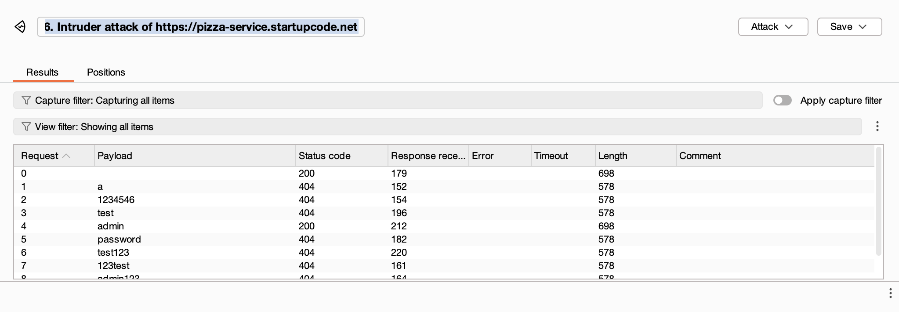
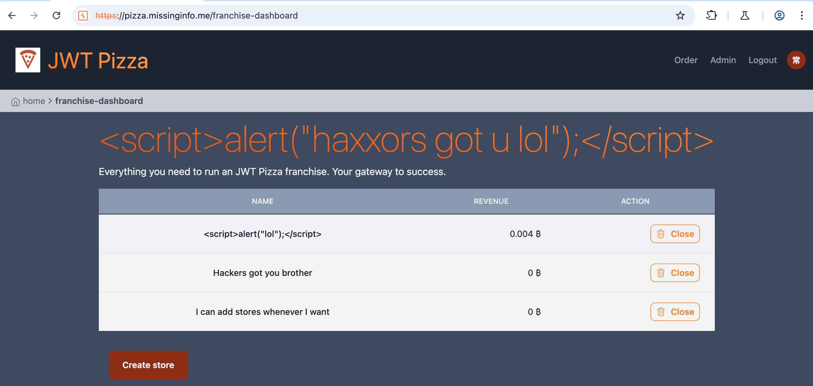

# SQL Injection and CORS Vulnerability Report
## Team Members
- Curtis Rosenvall
- Ash Hammond

Self Attack Curtis
| Item | Result |
|------|--------|
| Date | 04/14/2025 |
| Target | pizza-service.startupcode.net |
| Classification | Injection |
| Severity | 2 |
| Description | I did a brute force injection of 50 different passwords to the PUT/api/auth endpoint. |
| Images |  |
| Impact | The admin password was discovered. Possible attack using admin credentials |
| Corrections | I set a rate limit on the /api/auth endpoint |

| Item | Result |
|------|--------|
| Date | 04/14/2025 |
| Target | pizza.missinginfo.me |
| Classification | Broken Access Control |
| Severity | medium |
| Description | knowing how users are stored on the local system, a user can change their user in local storage to the admin and get access to the admin dashboard. |
| Images |   |
| Impact | They cannot add any franchises with this, but they can see the current franchises and what stores they own. |
| Corrections | Make sure the admin dashboard can either only be accessed by a limited number of IPs, and authenticate the page with an auth token instead of just the role. |

Peer Attack
Attack Record Curtis -> Ash: [Attack Name]
| Item | Result |
|------|--------|
| Date | 04/14/25 |
| Target | pizza.missinginfo.me |
| Classification | Security Misconfiguration |
| Severity | 4 |
| Description | I can log into admin account/ or any user account and buy pizzas using their accounts or using the admin account I can create stores and manipulate data. I can do all of this because of a default password. |
| Images |  |
| Impact | very vulnerable to attacks. Anyone could order pizza on other users accounts |
| Corrections | limit api/auth rates so no passwords could be stolen |

Attack Record Ash -> Curtis:
| Item | Result |
|------|--------|
| Date | 04/14/2025 |
| Target | pizza-service.startupcode.net |
| Classification | Server side request forgery |
| Severity | High |
| Description | A user can intercept an order post request packet and change the price in that packet. They can then pass on the packet and the server takes it like nothing happened, charging whatever price that user specified for it. |
| Images |   |
| Impact | Users can get Pizza for free. |
| Corrections | Make sure prices are specified on the backend and not on the frontend. Make it so the users can only request pizzas and the server figures out what the price should be of of the amount and types of ordered pizza. |